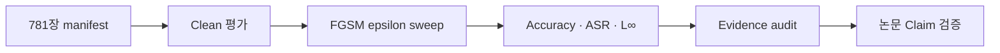

<div align="center">

# 자율운항선박 이미지 분류 모델 적대적 AI 검증

### Clean → FGSM → 전처리 방어 비교 → Evidence Audit 기반 해양 AI 보안 연구

<a href="https://maritime-adversarial-lab.hc24734503.chatgpt.site/">

</a>

[](https://maritime-adversarial-lab.hc24734503.chatgpt.site/)

[MARIS 가상 실험실 바로가기](https://maritime-adversarial-lab.hc24734503.chatgpt.site/) · [웹 소스 및 실행 안내](web/maris/README.md)

위 링크에서 MARIS 가상 실험실을 열 수 있습니다.
저장 결과를 재생하는 공간이며 실제 자율운항 제어 또는 실시간 모델 추론이 아닙니다.

<br>


선박 사진을 인식하는 AI가 미세한 입력 교란에도 안전한지 확인하고,  
실험 결과가 원자료와 일치하는지 자동으로 다시 검증합니다.

[30초 요약](#30초-요약) · [작동 방식](#한눈에-보는-검증-방식) · [핵심 결과](#핵심-결과를-쉽게-읽으면) · [재현 방법](#빠른-시작) · [기술문서](#문서-안내)

**2026 스마트해운물류 × ICT 멘토링**

</div>

---

## 30초 요약

> **한 문장으로:** 선박 분류 AI가 정상 사진은 얼마나 잘 맞히는지, 정해진 픽셀 변경 범위에서 판단이 얼마나 달라지는지, 그 결과를 다시 검증할 수 있는지를 연구합니다.

자율운항선박은 카메라로 주변 선박의 종류와 상황을 파악할 수 있습니다. 그런데 공격자가 이미지의 픽셀을 아주 조금 바꾸면 사람 눈에는 비슷해 보여도 AI의 판단은 달라질 수 있습니다. 이 프로젝트는 이러한 **적대적 공격(adversarial attack)**을 선박 이미지 분류 모델에 적용해 취약성을 측정합니다.

- CNN과 MobileNetV2가 공격 없는 사진 781장을 분류하는 기준 성능을 확인했습니다.
- 가장 기본적인 1단계 공격인 FGSM을 구현하고 교란 크기가 약속된 범위를 넘지 않는지 검사했습니다.
- 공격 성공률은 원래 정답을 맞힌 사진만 대상으로 계산해 수치가 과장되지 않도록 했습니다.
- CSV·JSON·manifest·모델 해시·문서의 수치가 서로 맞는지 독립 감사 도구로 다시 확인합니다.
- 확정된 공격 강도는 **ε=0, 0.01, 0.03, 0.05**입니다. CNN·MobileNetV2의 Clean·FGSM 및 고정 3×3 가우시안·평균 필터 비교는 실험과 기록 감사를 완료했습니다. 원자료의 `provisional`·`experimental` 표기는 보존 이력이며, 연구 범위 미확정을 뜻하지 않습니다.

[실무 활용·평가 기준 대조](docs/MARITIME_PRACTICE_GAP_REVIEW.md): 실제 해상 영상 시스템과의 차이, 배경 참고와 후속 과제. 작은 L∞ 값만으로 사람에게 보이지 않는 교란임을 입증하지는 않습니다.

## 최신 통합 상태

<!-- verification-status:start -->
| 검증 구분 | 상태 | 확인 범위 |
|---|---|---|
| [연구 수행 PC 재현](https://github.com/heechan9/AdversarialAI_Security/blob/e6e575fa3df1247f8e43ac9749a573329f62a910/docs/STAGE_B_PC_FULL_20260928.md) | LOCAL_PASS | 모델 2개·781장·두 필터·ε 4개. 라벨·요약 지표 비교 완료, 확률값 비교 제외. |
| [외부 독립 재실행](https://github.com/heechan9/AdversarialAI_Security/blob/e6e575fa3df1247f8e43ac9749a573329f62a910/docs/STAGE_B_HYEONSU_01_REVIEW.md) | FAIL | 보존 결과에서 16개 예측 차이. 평균 필터는 보조 진단이며 외부 전체 검증 PASS가 아닙니다. |

환경 간 차이의 정확한 원인은 미확정입니다. 로컬 일치를 외부 독립 검증 통과로 해석하지 않습니다.

| 추적 항목 | 처리 상태 | 이력 |
|---|---|---|
| 환경 간 MobileNetV2 예측 불일치 | 미해결 | 2건 |
<!-- verification-status:end -->

### 2026-10-01 검증·제출 상태 갱신

- **연구 수행 PC 전체 재실행: LOCAL_PASS.** 9월 28일 17:21 KST 완료, 10월 1일 반환 ZIP 수신·감사. CNN·MobileNetV2 × ε=0, 0.01, 0.03, 0.05 × Gaussian·Mean의 CSV 16개, 각각 781행을 실행 커밋 `b86f725`의 기준과 다시 비교했다. 다섯 경로의 예측 라벨 62,480개 및 요약 지표 비교에서 차이 0건이다. 고유 이미지 수는 781장이며 확률 벡터는 비교하지 않았다.
- **외부 독립 검증: 기존 FAIL 유지.** 외부 실행의 MobileNetV2 14장·16개 예측 차이는 이번 PC에서 모두 기준과 일치했으나, 환경 간 차이의 단일 원인은 미확정이다. 같은 공격 배열의 환경 간 교차 분류는 추가 작업이다. 로컬 재현을 외부 독립 검증 승인으로 쓰지 않는다.
- **논문 제출 완료(사용자 확인).** 실제 제출본은 `KIPS 학술벌표대회_김태희팀_0930_멘토검토본.doc`이다. v7.5는 이전 로컬 검토본이다. 제출 파일은 수정하지 않으며 접수증·학회 채택은 별도로 확인한다.
- PR #21의 상태 문서 동기화에 이어, 개인 저장소의 진단 도구·비교기 개선·검증 등록부·불일치 처리 이력을 코드와 근거 파일로 통합했다. 운영 웹 배포는 별도다. 기존 실험 수치·모델·승인 필드·허용오차는 유지한다.

[전체 PC 수신 감사·환경 비교](https://github.com/heechan9/AdversarialAI_Security/blob/e6e575fa3df1247f8e43ac9749a573329f62a910/docs/STAGE_B_PC_FULL_20260928.md) · [파생 감사 JSON](https://github.com/heechan9/AdversarialAI_Security/blob/e6e575fa3df1247f8e43ac9749a573329f62a910/results/verification/stage_b/pc_full_20260928/received_audit.json) · [제출본 보존 기록](https://github.com/heechan9/AdversarialAI_Security/blob/e6e575fa3df1247f8e43ac9749a573329f62a910/docs/PAPER_RELEASE_STATUS.md)

### 9월 19일 통합 이력

2026-09-19 기준, Clean·FGSM·가우시안·평균 필터 실험과 MARIS 회색 CAD 보기·방어 비교 소스가 반영되어 있습니다.
문서 반영, 실험 결과의 공식 채택, 최종 논문 검증은 별도로 관리합니다.

- 고정 3×3 가우시안·평균 필터 전처리, 전달 FGSM 및 방어 인지 FGSM 비교를 구현·실험했습니다.
- 기존 공격에 전처리를 적용한 개선만으로 방어 성공을 주장하지 않습니다.
  방어 인지 공격에는 효과가 크게 떨어지고 정상 정확도에도 모델별 영향이 있습니다.
- 가우시안 통합 당시 PR #25에서 Codex와 Jules가 각각 247 passed / 경고 2개를 보고했습니다.
  당시 Research·Paper(9/9)·Stage A·가우시안 근거 감사 기록이며, 이후 평균 필터·최신 원고 전체의 검증 결과로 확대하지 않습니다.
- 논문 버전·원본 확보·검증·게시 상태는 [논문 관리 현황](docs/PAPER_RELEASE_STATUS.md)에서 구분합니다.
- 원본 ZIP·CSV·모델 및 기존 공격 결과는 보존했습니다. 실제 모델 추론 재현과
  기록의 재계산 감사는 구분합니다.

[현재 연구 범위와 결과](docs/CURRENT_RESEARCH_STATUS.md) ·
[Gaussian 근거](results/defenses/experimental/gaussian_run_01/README.md) ·
[평균 필터 근거](results/defenses/experimental/mean_run_01/README.md) ·
[Jules 감사](https://jules.google.com/session/11380383362183201753)

## 한눈에 보는 검증 방식

<div align="center">


</div>

1. **기준 성능을 측정합니다.** 공격하지 않은 781장으로 CNN과 MobileNetV2의 Clean 성능을 확인합니다.
2. **사진에 작은 교란을 넣습니다.** FGSM이 손실이 커지는 방향으로 픽셀을 한 번 변경합니다.
3. **취약성을 수치로 비교합니다.** 공격 후 정확도, 정확도 하락폭, 공격 성공률(ASR), 최대 교란량을 계산합니다.
4. **결과의 근거를 다시 검사합니다.** 원자료와 요약표·문서가 다르거나 데이터가 변조되면 감사 프로그램이 실패 코드로 종료됩니다.

> 이 이미지는 연구의 검증 흐름을 설명하기 위한 시각화입니다. 실제 선박을 자동 제어하거나 실시간 항만 운영시스템과 연동한 화면이 아닙니다.

## 지금 어디까지 완료됐나

| 연구 단계 | 상태 | 확인된 범위 |
|---|---:|---|
| Clean baseline | ✅ 검증 완료 | CNN·MobileNetV2, 테스트 이미지 781장 |
| FGSM 구현 | ✅ 검증 완료 | 공격 방향·입력 clipping·L∞ 상한·epsilon 0 대조군 |
| FGSM 성능 수치 | ✅ 실험·기록 감사 완료 | 확정 범위 $\epsilon=0, 0.01, 0.03, 0.05$; 원자료 상태는 아래 설명 참조 |
| 연구근거 감사 | ✅ 검증 완료 | manifest·모델 해시·CSV·JSON·문서 일관성·시각 검토 감사 |
| 논문 Claim 감사 | ✅ 9/9 통과 | 기존 v1.5 claim snapshot 감사; 최신 원고 전체의 검증 완료를 뜻하지 않음 |
| 가우시안·평균 필터 방어 | ✅ 실험·기록 감사 완료 | 고정 3×3 전처리; 기존 FGSM 입력 및 방어 인지 FGSM 비교·근거 감사 |
| MARIS 가상 실험실 | ✅ 구현·소스 반영 | 설명용 3D 조작·저장된 이미지 비교·결과 재생; 실시간 추론 아님 |
| BIM·PGD·JSMA·적대적 학습 | ⚪ 향후 연구 | 현재 검증 완료 범위에 포함하지 않음 |
| VLM/LLM·안전영향 시뮬레이터 | ⚪ 후속 확장 | 전체 프로젝트 로드맵; 현재 논문 실험 범위 밖 |

## 핵심 결과를 쉽게 읽으면

### 1. 공격 전에는 MobileNetV2가 더 정확했습니다

| 모델 | 정답 수 | 정확도 | 쉽게 읽으면 |
|---|---:|---:|---|
| CNN | 504 / 781 | 0.6453264951705933 | 약 64.5% |
| MobileNetV2 | 613 / 781 | 0.7848911881446838 | 약 78.5% |

MobileNetV2는 CNN보다 109장을 더 맞혔습니다. 다만 두 모델 모두 Sailboat와 DDG의 재현율이 상대적으로 낮아, 공격 이전부터 클래스별 약점이 존재했습니다.

### 2. 작은 FGSM 교란에도 성능이 크게 떨어졌습니다

아래 값은 **확정된 ε 범위에서 완료한 FGSM 실험의 보존 결과**입니다. CSV·JSON의 수치 일관성을 감사했습니다. 원자료는 기존 `provisional` 경로와 상태를 유지하며, 별도 공식 실행계약의 승인·재실행 기록은 아직 연결되지 않았습니다. 이는 ε 범위를 다시 정해야 한다는 뜻이 아닙니다.

| epsilon | CNN 공격 후 정확도 | CNN ASR | MobileNetV2 공격 후 정확도 | MobileNetV2 ASR |
|---:|---:|---:|---:|---:|
| 0.00 | 64.53% | 0.00% | 78.49% | 0.00% |
| 0.01 | 41.61% | 35.52% | 12.42% | 84.18% |
| 0.03 | 24.33% | 62.30% | 13.19% | 83.20% |
| 0.05 | 20.23% | 68.85% | 16.13% | 79.45% |

- **epsilon**은 이미지에 허용한 최대 변화량입니다. 값이 클수록 더 강한 교란입니다.
- **공격 후 정확도**는 교란된 전체 테스트셋에서 모델이 정답을 맞힌 비율입니다.
- **ASR(Attack Success Rate)**은 공격 전에는 맞혔지만 공격 후 틀린 사진의 비율입니다.
- MobileNetV2는 Clean 정확도가 더 높았지만 $epsilon=0.01$에서 ASR이 약 84.18%였습니다. 따라서 이번 실험에서는 **높은 일반 정확도가 공격 강건성을 보장하지 않았습니다.**
- 비단조적인 MobileNetV2 결과의 원인을 FGSM overshoot라고 단정하지 않으며, 추가 실험 전에는 관찰 사실로만 기록합니다.

상세 근거: [Clean 결과](docs/CLEAN_BASELINE_RESULTS.md) · [FGSM 실험 결과](docs/FGSM_PROVISIONAL_RESULTS.md)

### 3. 단순 전처리 방어의 효과와 한계도 비교했습니다

고정 3×3 가우시안·평균 필터 전처리는 기존 FGSM 공격 이미지의 분류 정확도를 높였지만,
전처리까지 고려해 생성한 **방어 인지 FGSM**에는 효과가 크게 떨어졌습니다.
정상 이미지에서도 CNN 정확도는 낮아지고 MobileNetV2는 높아져, 모델별 영향을 함께 보고합니다.
이 비교 실험은 완료되었으며 원자료의 `experimental` 상태는 유지합니다. 관측된 회복은 일반적인 방어 성공이나 실제 운항 안전성을 입증하지 않습니다.

수치·분모·원자료: [가우시안 결과](results/defenses/experimental/gaussian_run_01/README.md) · [평균 필터 결과](results/defenses/experimental/mean_run_01/README.md) · [현재 연구 범위](docs/CURRENT_RESEARCH_STATUS.md).

## 기술 구조와 검증 원칙



- **입력 범위:** `rescale=1./255`, `[0,1]`
- **공격 방식:** Untargeted FGSM, true-label categorical cross-entropy, 정확히 1 step
- **공격 식:** `x_adv = clip(x + epsilon * sign(grad_x L), 0, 1)`
- **교란 계약:** `L_infinity <= epsilon + 1e-6`
- **대조 조건:** epsilon 0에서 정확도 하락·ASR·최대 $L_\infty$가 모두 0
- **ASR 분모:** 공격 전 정답을 맞힌 표본만 사용(CNN 504장, MobileNetV2 613장)
- **변조 탐지:** canonical 근거가 바뀌거나 문서 수치와 불일치하면 non-zero exit

## 프로젝트에서 증명한 역량

| 문제와 판단 | 수행 내용 | 확인 가능한 근거 | 실무 연결 |
|---|---|---|---|
| 높은 Clean 정확도만으로 AI 안전성을 판단할 수 없다고 정의 | 두 모델에 동일한 FGSM 평가계약과 epsilon sweep 적용 | 표본별 CSV·요약 JSON·모델별 보고서 | AI 모델 강건성 평가 |
| ASR 계산 방식에 따라 결과가 과장될 수 있음을 통제 | Clean-correct 표본만 분모로 사용하고 epsilon 0 대조군 적용 | 실험 계약·단위 테스트·변조 테스트 | 공정한 KPI 설계·품질보증 |
| 논문 수치와 원자료가 따로 변할 위험을 관리 | manifest·모델 SHA-256·CSV·JSON·문서를 동적으로 교차 검증 | Evidence Audit PASS·Paper Claims 9/9 | 데이터 거버넌스·감사 가능성 |
| 구현 범위와 향후 목표가 섞이지 않도록 구분 | FGSM 실험 결과와 BIM·PGD·VLM/LLM 계획을 명시적으로 분리 | 프로젝트 범위·결과 문서·주장 경계 | 책임 있는 기술 커뮤니케이션 |

> **최희찬의 역할:** 연구 범위와 감사 요구사항을 정의하고, Windows 환경에서 원본 이미지 781장과 로컬 모델 바이너리를 사용해 무결성·재현성·테스트를 검증했으며, 결과 리뷰와 저장소 통합을 담당했습니다. 구현·검증의 세부 출처는 [기여 기록](CONTRIBUTIONS.md)에 구분합니다.

## 왜 결과를 신뢰할 수 있나

| 검증 대상 | 확인 방법 |
|---|---|
| 테스트 데이터 | 781개 파일의 순서·구조·SHA-256 manifest 검사 |
| 모델 | CNN·MobileNetV2 메타데이터와 로컬 바이너리 SHA-256 대조 |
| Clean 결과 | 표본별 예측 CSV에서 정답 수와 정확도를 다시 계산 |
| FGSM 결과 | epsilon별 표본 CSV에서 정확도·ASR·$L_\infty$를 다시 계산 |
| 문서·논문 주장 | canonical CSV·JSON과 README·결과문서 수치를 교차 검사 |
| 변조 내성 | 수치·분모·해시·manifest·문서를 고의로 바꾸는 mutation test |

원본 이미지와 `.h5` 모델이 없는 깨끗한 Git checkout에서는 해당 바이너리의 내용 검사가 `UNAVAILABLE`로 기록되며, 확인하지 못한 항목을 PASS로 보고하지 않습니다.

## 빠른 시작

```bash
pip install -r requirements.txt
export PYTHONPATH=src

python -m pytest -q
python scripts/audit_research_evidence.py
python scripts/audit_paper_claims.py
```

Windows CMD:

```bat
conda activate adversarial_ai
cd C:\Users\hc247\AdversarialAI_Security
set PYTHONPATH=src

python -m pytest -q
python scripts\audit_research_evidence.py
python scripts\audit_paper_claims.py
```

- `audit_research_evidence.py`: 데이터·모델·Clean·FGSM·문서의 연구근거를 종합 검사
- `audit_paper_claims.py`: 논문 초안 표시값을 포함한 9개 Claim을 canonical 근거에서 재계산
- 모든 검사가 통과하면 exit code 0, 누락·변조·계약 위반이 있으면 exit code 1

## 저장소 구성

| 경로 | 역할 |
|---|---|
| `configs/` | 클래스·테스트 manifest·실험 설정 |
| `src/adversarial_ai/` | 공격·평가·무결성·감사 패키지 |
| `scripts/` | 감사 및 실험 실행 진입점 |
| `tests/` | 계약·무결성·변조 탐지 테스트 |
| `results/clean/` | canonical Clean 결과 |
| `results/attacks/provisional/` | 공식 승격 전 FGSM 실험 결과 |
| `results/audit/` | 연구근거 감사 보고서 |
| `docs/` | 범위·실험계약·결과·재현성 문서 |

## 문서 안내

| 문서 | 내용 |
|---|---|
| [프로젝트 범위](docs/PROJECT_SCOPE.md) | 완료 범위·Decision Gate·향후 연구 |
| [실험 계약](docs/EXPERIMENT_CONTRACT.md) | 입력·FGSM·지표·재현 기준 |
| [Clean 결과](docs/CLEAN_BASELINE_RESULTS.md) | 모델별 기준 성능과 클래스별 한계 |
| [FGSM 실험 결과](docs/FGSM_PROVISIONAL_RESULTS.md) | epsilon별 결과와 해석 제한 |
| [재현성 안내](docs/REPRODUCIBILITY.md) | 데이터·모델 배치와 실행 방법 |
| [연구근거 감사](docs/RESEARCH_EVIDENCE_AUDIT.md) | 감사 범위·상태·CLI |
| [논문 Claim 감사](docs/PAPER_CLAIM_AUDIT.md) | 9개 Claim과 canonical 근거 |
| [통합 검토 기록](docs/INTEGRATION_REVIEW.md) | Draft 통합 범위·검증 결과·남은 로컬 실행 |
| [공식 후보 준비 절차](docs/FGSM_OFFICIALIZATION_RUNBOOK.md) | 단일 승인 계약·실행 ID·후보 감사 |
| [독립 Clean 재계산](docs/INDEPENDENT_VERIFICATION.md) | 현수 Stage A와 Codex 후속 검토 |
| [해양 위협모델](docs/THREAT_MODEL.md) | 이미지 분류 실험과 운영 영향의 구분 |
| [Plymouth 연구 대조](docs/PLYMOUTH_RESEARCH_ALIGNMENT.md) | 관련 연구·즉시 적용·장기 확장 경계 |
| [시각 검토 감사](docs/VISUAL_REVIEW_AUDIT.md) | 동적 후보 추출과 시각 검토 근거 검증 |
| [인과적 안전성 검증](docs/CAUSAL_SECURITY_VALIDATION.md) | 분류 취약성과 실제 운항 영향의 구분 |
| [직무 연계](docs/ROLE_ALIGNMENT.md) | 구현 증거·직무 연결·주장 한계 |
| [기여 기록](CONTRIBUTIONS.md) | 사람·AI 협업 역할과 검증 원칙 |

## 현재 한계

- FGSM 실험과 기록 감사는 완료되었습니다. 원자료의 `provisional` 상태와 별도 공식 실행계약의 미연결 승인·재실행 기록은 보존하며, 확정된 ε 범위와 구분합니다.
- 두 모델의 입력 해상도는 CNN 128×128, MobileNetV2 224×224로 다릅니다.
- MobileNetV2의 학습 당시 실제 전처리·분할 비율·random seed는 확정되지 않았습니다.
- 고정 가우시안·평균 필터 전처리 방어는 구현·실험 및 기록 감사를 완료했습니다. 원자료는 `experimental`로 보존합니다. 기존 공격 입력에서의 회복만으로 방어 성공을 주장하지 않으며, 방어 인지 FGSM과 정상 성능 손실을 함께 평가합니다.
- BIM·PGD·JSMA·적대적 학습과 모델 간 전이 공격은 현재 검증 완료 범위에 포함하지 않습니다.
- 분류 성능 저하가 실제 충돌·항로 이탈 같은 운항 피해를 유발한다는 인과관계는 검증하지 않았습니다.
- VLM/LLM과 안전영향 시뮬레이터는 향후 목표이며 현재 구현 성과로 주장하지 않습니다.

---

<div align="center">

**재현 가능한 실험, 검증 가능한 수치, 과장하지 않는 결론을 우선합니다.**

</div>
